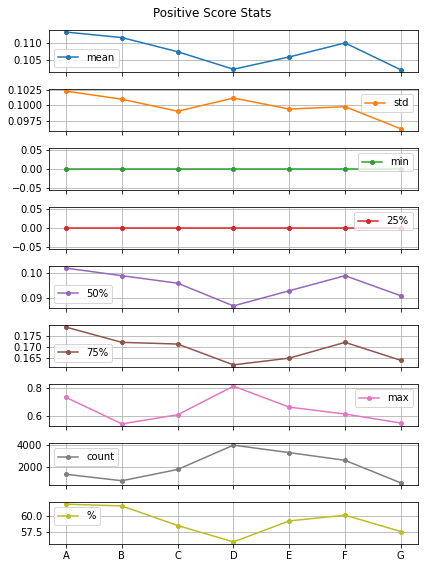
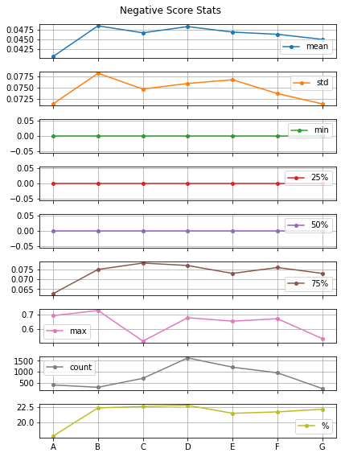
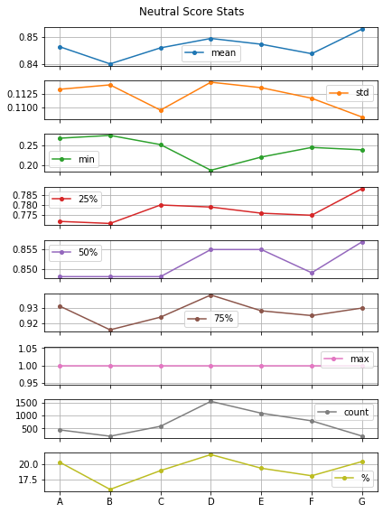
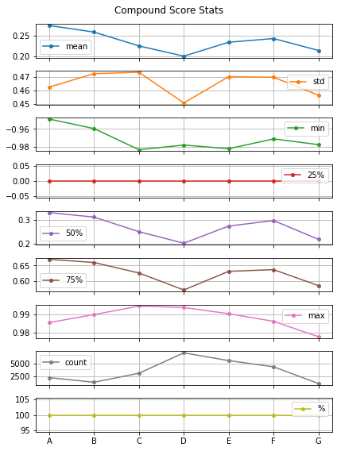

## History of Cryptocurrency
#### What is Cryptocurrency?

**Cryptocurrency** is such a prevailing topic that in the recent five years, not only business people but also many people from different fields were talking about it. However, the concept of cryptocurrency was largely constrained itself to a small group of computer scientists about a decade ago. After a huge wave of fluctuation on both bitcoin price and graphic cards, people became more and more familiar with and acquired different understandings about this newly developed, mysterious and state-of -art concept.

A **cryptocurrency** (crypto-currency, or crypto) is a collection of binary data which is designed to work as a medium of exchange. However, the attributes of cryptocurrency are quite ambiguous, especially the property of **decentralization**, which means that it’s not issued by any central bank. This leads to the fact that the currency has **no national force** to support it, and the price can be sensitive to many factors. Recall that in the stock market, sentiment towards a specific stock can be a huge factor to influence the price, so we wonder whether sentiment applies the same effect on the cryptocurrency price. With the help of quotation dataset from **Quotebank**, we could explore the possibility of this idea. Before digging deeper, let’s first take a look at what people are talking about the cryptocurrency! 

## Quotations per Year and Topics Shifts 
#### What topics about Bitcoin are popular in Quotebank, what contents are included in each topic? & How does the trend of topics about Bitcoin change over time?

From our quotation dataset, we find the distribution of quotations about cryptocurrency on different time periods.

<iframe frameborder="no" border="0" marginwidth="0" marginheight="0" width="100%" height="550" src="plot/price_quote.html"></iframe>

We can observe that people had a huge crush on cryptocurrency during the period between **the end of 2017 and the middle of 2018**. Before this period, the number of quotations was quite poor, no more than approximately 250 quotations per month, which is exactly the fact we are talking about in the [History of Cryptocurrency](#history-of-cryptocurrency). There were only a small number of people who were familiar with this concept at that time. After the huge breakout at the beginning of 2018, the number of quotations decreased to a stable level, around 500 per month. At that time, even layouts were actually very much aware of the concept, although the number of quotations underwent a sharp deacy, it still had much attention. 

Notice that there is a huge peak around the beginning of 2018. We paid additional attention to this period by analyzing it separately in the following analysis. 

Since there are lots of discussions about the crypto currency in the past five years, we are wondering how topics about cryptocurrency change over time? We summarize the most popular topics over different years. 

From the result, we can see that the topic shifts significantly over different years and we can generally observe how crypto evolves during the past five years. In 2015, Bitcoins started to pop up and people were realizing the value of Bitcoin in the realm of payment methods. It demonstrates the very beginning of blockchain technology, especially Bitcoin, in the public realm. In 2016, more cryptos were coming into the market and economic system more deeply, including Ethereum, also one of the new cryptos and the hottest one in 2016. Etheruem received more discussions due to a new kind of blockchain technology used for it and it shows right after the beginning of Bitcoin, the development in blockchain technology developed very fast within one year. At the same time, crypto companies were urged to expand the influence of crypto by looking for financial institutions to support them. Also from the topic, we can observe there are interest conflicts between banks and crypto companies. 

## Like it? Or hate it?
#### Let’s take a look at people’s attitudes towards cryptocurrency! 

We divide periods annually except for the time period around the beginning of 2018. It was so popular at that time!

Let's take a first bite of people's general attitudes.

<!--div class="myban"-->

<!--/div-->

<iframe frameborder="no" border="0" marginwidth="0" marginheight="0" width="100%" height="550" src="plot/general_comp.html"></iframe>

(By clicking the different tags at the top-right corner to hide the corresponding trace, you may have a clearer view!)

<iframe frameborder="no" border="0" marginwidth="0" marginheight="0" width="100%" height="550" src="plot/general_dist.html"></iframe>

Playing around the above plots, we find that people may have a more “positive” attitude towards cryptocurrency than “negative” attitude.   

Then let's take a closer look at different periods and try to figure out whether different sentiments have an effect on the bitcoin price.

    
    

    
    

- From compound score stats, we can clearly see that there exists a valley point of the mean value, 50% percentile (median), and 75% percentile during the event period, this reveals that the distribution is less right-skewed, we can confirm this by examining the compound store histogram and the score stats of the event period. The histogram shows that the difference of the left section (generally negative) and the right section (generally positive) is smaller. The score stats also show that the percentage of negative and neutral quotations both reach a summit, whereas the percentage of positive quotations clearly reduces. Besides, we can catch a general sentiment trend from 2015 to 2020 by examining the line graphs: **speakers in QuoteBank are losing their positive comments towards crypto-related topics**.

- From positive score stats, we can see that the percentage of positive quotations is at the highest in 2015, then steadily declines and reaches a lowest point in the event period, although the percentage bounces in 2018 & 2019, it still drops in 2020's quotations. The positive score mean, median, and 75% percentile are consistent with this trend, except for the mean reaching the valley point in 2020. However, we notice that the most positive quotation happens to occur in the event period. In the histogram we also notice there exists more very positive quotations (positive score > 0.6) than any other period both numerically and proportionally, this hints a polarized sentiment trend during this period.

- From negative score stats, we can see that the percentage of negative quotations greatly increases in 2016 and then gradually increases to the highest during the event period. Although slightly decreasing later, it still remains at highs. The negative score means 75% percentile follows this trend. An interesting point is that over 50% of quotations have no negative sentiment and the 75% percentile is less than 0.1, this means that the level of negative sentiment is relatively low.

- From neutral score stats, we can see that the percentage of neutral quotations fluctuates among different periods, lowest in 2016 and highest in the event period. Combining the former analysis, quotations are becoming more neutral throughout the years (generally rising mean and the quantiles), and shows a polarized sentiment pattern (lowest neutral score in the event period, and increasing proportion of very biased (neutral score < 0.4) quotations).

(Examples)

We pick up extreme attitudes for the analysis. For the  

## Speaker Portrait
#### Who talk about cryptocurrency the most? What are their attitudes towards it?

We divide people into different occupations and make an analysis based on this division. There are people with more than 300 hundred occupations discussing crypto. We list the top ten occupations and plot the distributions in the order of total quotation numbers.

We can observe that businesspeople have the most quotation number among all other occupations. Politicians come second with 1439 quotations. Journalists and researchers are the third and fourth most frequent speakers about crypto with 1109 and 1013 quotations within the last five years.

We are interested in the analysis within different occupations—how do perspectives of people differ with specialized skills. We focus on the top two occupations, business people and politicians. 

<iframe frameborder="no" border="0" marginwidth="0" marginheight="0" width="110%" height="600" src="plot/occu_compare.html"></iframe>

## Combined analysis of quotation numbers with Bitcoin Price

The Bitcoin price can be extracted from [CoinMarketCap](https://coinmarketcap.com/currencies/bitcoin/historical-data/). We wanna know if there is a correlation between quotation numbers with the Bitcoin price.

<iframe frameborder="no" border="0" marginwidth="0" marginheight="0" width="100%" height="550" src="plot/price_quote.html"></iframe>

This figure describes the quotation numbers and the fluctuation of Bitcoin price simultaneously. Because there are some dates that are missing the quotations of Bitcoin, we take a period of 14 days as an analysis basis (rolling 14 days) to see the correlation. Y axis on the left (rolling_14_close) is the Bitcoin price at the end of the 14 days period.

From the above line plots, we would initially speculate that the number of quotations may correlate with the fluctuation of Bitcoin price in a general sense but especially in the period around 2017 and 2018. Around the beginning of 2018, the quotation underwent a vast boost and this trend matches perfectly well with the bitcoin price peak around that time.

If we run a Pearson test, we have a p value (1.70e-23) which is far smaller than 0.05, meaning the that Bitcoin price and 14-day rolling mean of # quotations do positively correlate with each other, with a small correlation r = 0.24. Based on this fact, we will find out the period which gives the largest correlation |r| with p << 0.05.

We further look into the correlation over different time periods.

We summarize in the below:
- The general pearson test on Bitcoin price and rolling 14-day # quotations give a small but positive correlation between these two indicators. This means that from a larger scale over the periods, when Bitcoin price rises, 14-day rolling mean # quotations have a tendency to increase correspondingly. Generally, we could say that the fluctuation of Bitcoin price does affect speakers' interest on crypto-related topics. However, from the line plots and separated Pearson tests we could still see that this general correlation acts poorly for 2015-2016, 2019-2020. But if we take a closer look on the curve trend, in 2015-2016 both Bitcoin price and # quotations remain at low quantity. This may reveal that crypto is not widely known to the public and it has not yet become a popular topic.

- Separated analysis on 2017.01-2017.09 and 2018.04-2018.12 gives us a negative correlation result which counters our expectation. By checking the line plots, there exists a possible delay effect between the indicators: if we right shift the rolling mean curve, then we could possibly get a more positive correlated result. This delay effect may reflect speakers' comments and attitudes towards the crypto market, and they later bring impact to the Bitcoin market since named speakers are mostly influential.

- The Bitcoin price increases rapidly in 2017, and suddenly drops in 2018, and # quotations fluctuate correspondingly. Pearson tests in 2017-2018 and the event period confirms this trend. 

## Combined analysis of quotation numbers with Bitcoin Price

Finally, we are curious about whether there is correlation between Bitcoin price and people’s sentiment towards it. To do this, we ran a sentiment analysis on all the quotations over different time periods and analyzed the correlation with positive, negative, neutral and compound scores.

<iframe frameborder="no" border="0" marginwidth="0" marginheight="0" width="110%" height="600" src="plot/price_compound.html"></iframe>

First, we present different scores and bitcoin prices over time. The y axis on the left (Close) is the bitcoin price at the end of each day. Although it may seem that they have no correlation from the line plot, the general person test shows us the … score actually has a weak positive correlation (r=, p=) with the fluctuation of Bitcoin price. By checking the line plot, we speculate that this correlation comes mainly from the event after 2017. Now we conduct separated correlation testing within different time periods to test our hypothesis.

We make a summarization in the below:
- The result of general analysis on compound, positive, and negative sentiment scores reveals that crypto-related quotations' sentiment does have correlation with the Bitcoin price. However, the pearson r for all four sentiment scores are relatively small, which means the correlations are not strong. 

- Separation analysis on the compound score and the positive score shows similar positive correlation from 2016 to 2019, whereas the negative score shows negative correlation only in 2016, 2019, and 2020. This correlation pattern may suggest that a positive score determines the compound score correlation more than the negative score.

- Separation analysis on the neutral score shows that in each separation during 2017-2018, neutral score is negatively correlated to Bitcoin price. Combining the fact that quotations are heavily distributed in these separations, this suggests that polarized crypto quotations may correlate to a decrease in Bitcoin price, which means the Bitcoin price would affect speakers' neutrality.

## Combined analysis of quotation numbers with Bitcoin Price
### The evolution story of crypto, Bitcoin in the last 5 years

Given the analysis above, we may reach the answer of the puzzle stated at the very beginning of our data analysis. In general, there seems to be a weak correlation between the bitcoin price and people’s sentiment towards it. If we take the compound score over different time periods seriously, we may easily reach the conclusion that Bitcoin prices are actually correlated with people’s sentiment, which also makes sense because people will complain or praise Bitcoin if the price is fluctuating and indeed people’s attitude will influence the prices in turn. 

There are many reasons that can count for the weak correlation. One of the biggest factors is that there are many unobserved covariates that will affect speakers’ attitude and the bitcoin price simultaneously. Given the limitation of quotebank dataset, we cannot avoid such problems. One way to deal with it is to introduce other datasets and complex economic theory, which is too heavy for our analysis. Also, the way we process the Bitcoin price and the division of time period will also have influence on the final analysis on the sentiment correlation result. 

## References
