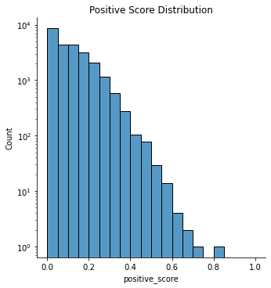
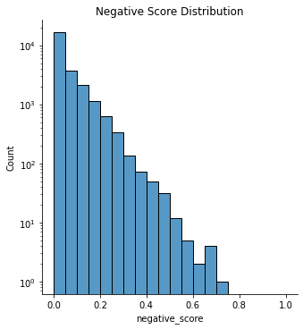
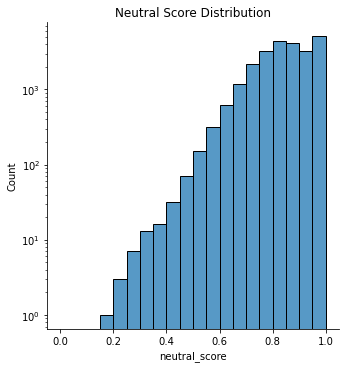
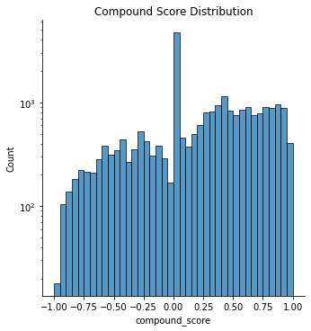

## History of Cryptocurrency
#### What is Cryptocurrency?

Cryptocurrency is quite a prevailing topic in the recent 5 years and we can hear not only business people but also many layouts talk about it. But this concept was largely constrained itself only in a small group of computer scientists one decade ago. After it exerted influence on the price of Graphics and underwent huge price fluctuations, people were becoming more and more familiar with this newly developed concept with different understandings and behavior. 

A cryptocurrency, crypto-currency, or crypto is a collection of binary data which is designed to work as a medium of exchange. However, the attributes of cryptocurrency are quite ambiguous, especially in the property of decentralization, which means that it’s issued by the central bank. This leads to the fact that the currency has no national force to support it, the price can be more sensitive for many reasons. Recall that in the stock market, sentiment towards a specific stock can be a huge factor of its price, so we wonder whether it applies the same for the cryptocurrency price. Equipped with the quotation dataset, we may be able to have a research into it. But before going into the influence of people’s sentiment, let’s first start with analyzing in what sense people are talking about the crypto currency. 

## Quotations per Year and Topics Shifts 
#### What topics about Bitcoin are popular in Quotebank, what contents are included in each topic? & How does the trend of topics about Bitcoin change over time?

From the quotation dataset, we find the distribution of quotations about crypto currency during different time periods.

<iframe frameborder="no" border="0" marginwidth="0" marginheight="0" width="100%" height="550" src="plot/price_quote.html"></iframe>

We can observe that people are more likely to discuss it from the end of 2017 to the middle of 2018. Before that time, there were no more than approximately 250 quotations per month, which corresponds to the fact that there were only a small number of people who were familiar with this concept at that time. After the huge breakout around the beginning of 2018, the number of quotations decreased to a stable level around 500 per month. At that time, even layouts were actually very much aware of the concept and although the number of quotations underwent a sharp deacy, it still had much attention. 

Notice that there is a huge peak around the beginning of 2018, so we paid special attention to this period by taking it along in the following analysis. 

Since there are a lot of discussions about the crypto currency during the past five years, we are wondering how topics about crypto currency change over time? We summarize the hottest topics over different years. 

From the result, we can see that the topic shifts significantly over different years and we can generally observe how crypto evolves during the past five years. In 2015, Bitcoins started to pop up and people were realizing the value of Bitcoin in the realm of payment methods. It demonstrates the very beginning of blockchain technology, especially Bitcoin, in the public realm. In 2016, more cryptos were coming into the market and economic system more deeply, including Ethereum, also one of the new cryptos and the hottest one in 2016. Etheruem received more discussions due to a new kind of blockchain technology used for it and it shows right after the beginning of Bitcoin, the development in blockchain technology developed very fast within one year. At the same time, crypto companies were urged to expand the influence of crypto by looking for financial institutions to support them. Also from the topic, we can observe there are interest conflicts between banks and crypto companies. 

## Sentiment Analysis
#### What sentiment/attitude does each topic present, how does politician/researcher comment on Bitcoin differently? & Does sentiment/attitude have a correlation with the fluctuation of Bitcoin price generally and for each topic?

Now let’s take a look at people’s sentiment towards cryptos. We divide different periods basically by one year except for the time period around the beginning of 2018. 

We first make a very general analysis over all quotations.

    
    

    
    

From the general analysis, we find that more people have a positive attitude towards crypto than people who have a negative attitude.   

Then we take a closer look at different periods for our purpose to figure out how different sentiment may have an effect on the bitcoin price.

    
    

    
    

- From compound score stats, we can clearly see that there exists a valley point of the mean value, 50% percentile (median), and 75% percentile during the event period, this reveals that the distribution is less right-skewed, we can confirm this by examining the compound store histogram and the score stats of the event period. The histogram shows that the difference of the left section (generally negative) and the right section (generally positive) is smaller. The score stats also show that the percentage of negative and neutral quotations both reach a summit, whereas the percentage of positive quotations clearly reduces. Besides, we can catch a general sentiment trend from 2015 to 2020 by examining the line graphs: **speakers in QuoteBank are losing their positive comments towards crypto-related topics**.

- From positive score stats, we can see that the percentage of positive quotations is at the highest in 2015, then steadily declines and reaches a lowest point in the event period, although the percentage bounces in 2018 & 2019, it still drops in 2020's quotations. The positive score mean, median, and 75% percentile are consistent with this trend, except for the mean reaching the valley point in 2020. However, we notice that the most positive quotation happens to occur in the event period. In the histogram we also notice there exists more very positive quotations (positive score > 0.6) than any other period both numerically and proportionally, this hints a polarized sentiment trend during this period.

- From negative score stats, we can see that the percentage of negative quotations greatly increases in 2016 and then gradually increases to the highest during the event period. Although slightly decreasing later, it still remains at highs. The negative score means 75% percentile follows this trend. An interesting point is that over 50% of quotations have no negative sentiment and the 75% percentile is less than 0.1, this means that the level of negative sentiment is relatively low.

- From neutral score stats, we can see that the percentage of neutral quotations fluctuates among different periods, lowest in 2016 and highest in the event period. Combining the former analysis, quotations are becoming more neutral throughout the years (generally rising mean and the quantiles), and shows a polarized sentiment pattern (lowest neutral score in the event period, and increasing proportion of very biased (neutral score < 0.4) quotations).

    <iframe frameborder="no" border="0" marginwidth="0" marginheight="0" width="130%" height="600" src="plot/occu_compare.html"></iframe>

## References
